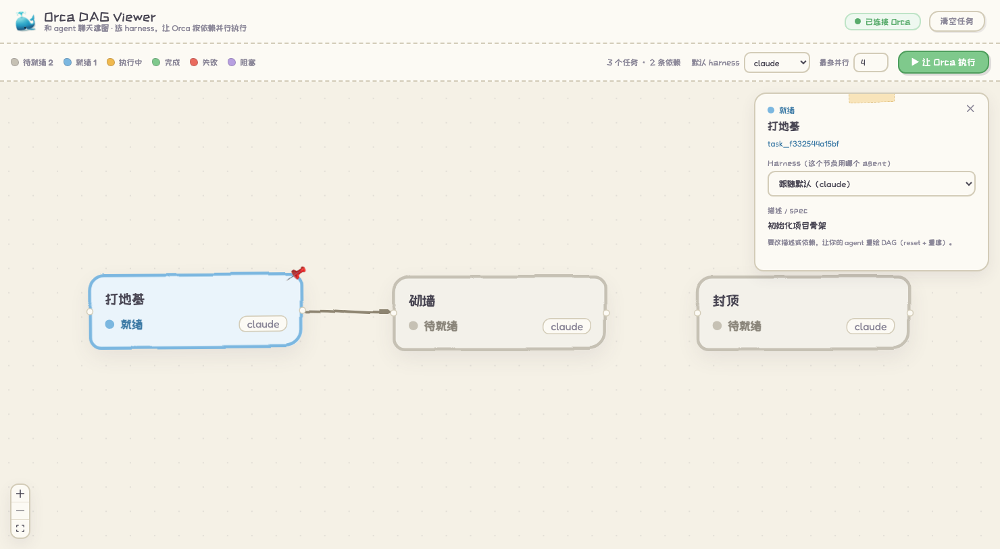

# Orca DAG — skill + viewer

把「和 agent 聊天规划」与「可视化 + 执行」拆成两个独立模块：

1. **skill**（`skill/SKILL.md`）：教**你自己的 agent**（Claude Code / kimi / …）如何把一个需求拆成 **Orca orchestration 的任务 DAG**，以及建图规范。规划的"大脑"在你的 agent 里，**不内嵌 Claude Agent SDK**。
2. **viewer**（`server/` + `web/`，编译成全局二进制 `orca-dag`）：连到 Orca 的编排状态，**实时可视化**这张 DAG；每个节点**各自选 harness**（claude / kimi / opencode / grok …），点 **「▶ 让 Orca 执行」**，viewer 内置的**自驱动 coordinator** 就按依赖把 ready 任务**并行**派发给按需拉起的自主 worker，直到整张图跑完。

> 核心流程：**agent 建图 → viewer 里给节点选 harness → Run → 按 DAG 并行自动执行**。要改某个任务或依赖，就让 agent 重绘 DAG（`reset` + 重建）—— Orca 没有改单个任务的接口。
>
> ⚠️ 为什么 viewer 自己当 coordinator：实测 `orca orchestration run` **不会真的派发任务**（起来了、常驻，但 ready 任务一个都不派）。所以 viewer 用已验证的 `dispatch --inject` 自己驱动派发循环。



## 它是怎么工作的

```
   你的 agent（加载 orca-dag skill）                 orca-dag viewer（全局二进制）
 ┌───────────────────────────────┐             ┌──────────────────────────────┐
 │  和你聊需求 → 拆解 → 建图        │             │  轮询 task-list → 画 DAG        │
 │  Bash: orca orchestration      │             │  每节点选 harness              │
 │        task-create / gate-*    │             │  ▶ Run → 自驱动 coordinator     │
 └───────────────┬───────────────┘             └───────────────┬──────────────┘
                 │  写编排状态                                     │  轮询 + dispatch --inject（并行）
                 ▼                                               ▼
        ┌──────────────────────────  Orca 编排状态  ──────────────────────────┐
        │  tasks / deps / gates   ·   按需拉起的自主 worker（各节点的 harness）    │
        └──────────────────────────────────────────────────────────────────┘
```

1. 你在**自己的 agent** 里聊需求。agent 加载 `orca-dag` skill，按规范用 `orca orchestration task-create --deps …` 把任务与依赖建进 Orca。
2. 打开 viewer（`orca-dag`）。它每 2 秒轮询 `orca orchestration task-list --json`，用 **dagre** 布局、**React Flow** 渲染，状态实时变色。
3. 在 viewer 里给节点选 harness（或用一个默认 harness 兜底），设置"最多并行"，点 **「▶ 让 Orca 执行」**。
4. viewer 的 **coordinator 循环**接管：每轮找出所有 `ready` 任务，**并行**为每个按需拉起（或复用空闲的）对应 harness 的**自主 worker**，`dispatch --task --to <worker> --inject` 派下去；worker 干完发 `worker_done` → 任务 `completed` → 依赖自动转 `ready` → 继续，直到全跑完，然后自动停并回收 worker。
5. 要改计划：回到 agent 对话让它重绘 DAG。

## 前置条件

- **Orca 运行中**：`orca status --json` 的 `result.runtime.state` 应为 `"ready"`；否则先 `orca open`。
- **项目是 Orca 管理的 worktree**：加 worker / 执行都要求当前目录是 Orca 注册的 repo/worktree（否则 `orca terminal create` 会报 `selector_not_found`）。用 `orca repo add <path>` 或 `orca worktree …` 先纳管。
- **一个能跑 skill 的 agent**（建图侧）：Claude Code、或任何能读 `SKILL.md` 并执行 Bash 的 agent。
- **viewer 侧只依赖 `orca` CLI** —— 不需要 `claude`、不需要 `ANTHROPIC_API_KEY`。
- **Bun**（可选，仅打二进制时需要）。**Node.js ≥ 20**（跑 dev / `npm start` 时需要）。

## 模块 1 · 安装 skill

```bash
ln -s "$PWD/skill" ~/.claude/skills/orca-dag      # 或直接拷贝到 agent 的 skills 目录
```

然后在 agent 里聊需求，它会按 `SKILL.md` 的规范把 DAG 建进 Orca，并提示你运行 `orca-dag` 打开 viewer。

## 模块 2 · 运行 viewer

开发（前端 5173 + 后端 8787，vite 代理 /api）：

```bash
npm install
npm run dev            # 打开 http://localhost:5173
```

打成全局二进制（推荐，可在任意 Orca-managed 项目目录直接调用）：

```bash
npm run build:binary                 # 产出 dist/orca-dag（约 60 MB，前端已内嵌）
cp dist/orca-dag /usr/local/bin/     # 装到 PATH

cd ~/any/orca-managed/project
orca-dag                             # 起在 http://localhost:8787，自动开浏览器；用当前目录当工作区
```

交叉编译（目标机自带 `orca` 即可）：`TARGET=bun-linux-x64 npm run build:binary`。
开关：`PORT`（默认 8787）、`NO_OPEN=1`（不自动开浏览器）、`WORKSPACE_DIR`（覆盖 `active` worktree）。

## viewer 能做什么

- **实时可视化** DAG，节点状态 `pending / ready / dispatched / completed / failed / blocked` 映射颜色；每个节点角上标着它的 harness。
- **每节点选 harness**：点节点在面板里选 `claude / kimi / opencode / grok / codex` 或自定义命令（存 localStorage）；没单独设的节点用顶栏的**默认 harness** 兜底。
- **▶ 让 Orca 执行 / ⏹ 停止** + **最多并行**：启动/停止 viewer 内置的自驱动 coordinator；worker 数由 DAG 并行度决定(能并行就并行,受"最多并行"上限约束)、按需拉起、空闲复用、跑完回收 —— **不用手动加 worker**。执行中显示"N worker"。
- **审批门**：agent `gate-create` 后，DAG 上浮出「批准 / 驳回」。
- **节点详情（只读 spec）**：点节点看 spec / 状态 / 结果。改描述或依赖 → 让 agent 重绘 DAG。
- **手绘蜡笔风**：🖍️ SVG feTurbulence 波动描边 + 米色速写本画布。

## HTTP 接口

| 方法 | 路径 | 作用 |
| --- | --- | --- |
| `GET` | `/api/dag` | 当前 DAG：`{ nodes, edges, gates, generatedAt }` |
| `POST` | `/api/run` | `{ harnessByTask?, defaultHarness?, maxConcurrency? }`：启动自驱动 coordinator |
| `POST` | `/api/run-stop` | 停止 coordinator 并回收已拉起的 worker |
| `GET` | `/api/run-status` | coordinator 实时状态：`{ running, busy, workers, error }` |
| `POST` | `/api/gates/:id/resolve` | `{ resolution }`：解决审批门 |
| `POST` | `/api/reset` | `orca orchestration reset --tasks` 清空任务 |
| `GET` | `/api/health` | 健康检查（返回 workspace 目录） |

## 代码结构

```
skill/SKILL.md            建图规范 + spec 写作约定 + 如何执行（选 harness + Run）+ 边界
server/src/
  index.ts                Express：DAG / run / run-stop / run-status / gates / reset；托管 SPA
  coordinator.ts          自驱动 coordinator 循环：轮询 DAG，并行 dispatch --inject 到按需/复用的 worker
  orca.ts                 orca CLI 封装：task-list→DAG、spawnWorker(自主 agent)、dispatchTask、close
  webAssets.ts            编译期内嵌前端资源的加载器（生产二进制用）
web/src/
  App.tsx                 全宽 DAG 主壳、每 2s 轮询
  components/DagView.tsx     React Flow 图 + 状态节点（含 harness 标签）
  components/ExecControls.tsx 默认 harness + 最多并行 + Run/Stop + 实时状态
  components/NodePanel.tsx    节点详情 + 每节点 harness 选择
  components/GatePanel.tsx    审批门浮层
  harness.ts                每节点 harness / 默认 harness（localStorage）
  layout.ts / types.ts / api.ts
scripts/build-binary.mjs  vite build → 内嵌资源 → bun --compile → dist/orca-dag
```

## 设计说明与边界

- **大脑外移**：规划由你已有的 agent 承担（skill 提供规范），viewer 不内嵌 Claude Agent SDK。
- **viewer 自己当 coordinator**：实测 `orca orchestration run` 不真派发任务，所以 `server/src/coordinator.ts` 用已验证的 `dispatch --inject` 自驱动。并行度由 DAG 决定（同时 ready 的任务一起派，受 `maxConcurrency` 上限）；worker 按需拉起、空闲复用、跑完回收。
- **worker 必须是自主 agent**：hands-off 执行要求 worker 能自己跑 `orca orchestration send --type worker_done` 回报 —— 否则会卡在权限确认。所以 `spawnWorker` 用免审批方式起 agent：`claude --dangerously-skip-permissions`（已验证）。其余 harness 的免审批开关见 `orca.ts` 的 `HARNESS_LAUNCH`，需各自填好并验证。
- **`dispatch --inject` 的坑**：它把 preamble 打进 agent 输入框，但常常**不自动提交**（就绪竞态）。coordinator 因此在 dispatch 后停 ~2s 再补发一个 Enter；对已提交/空输入的多余 Enter 是无害 no-op。
- **每节点 harness 存本地**：Orca 的 task 没有 harness 字段，所以每节点选的 harness 存在浏览器 localStorage（`harness.ts`），Run 时作为 `harnessByTask` 传给后端。
- **改不了已建任务**：`orca orchestration task-update` 只能改 `--status` / `--result`，**没有改 spec/标题/依赖的接口**，也没有删除单个任务的命令（只有 `reset` 整体清空）。所以"修改任务"= **让 agent 重绘 DAG**（`reset --tasks` 后重建，会换 id）。
