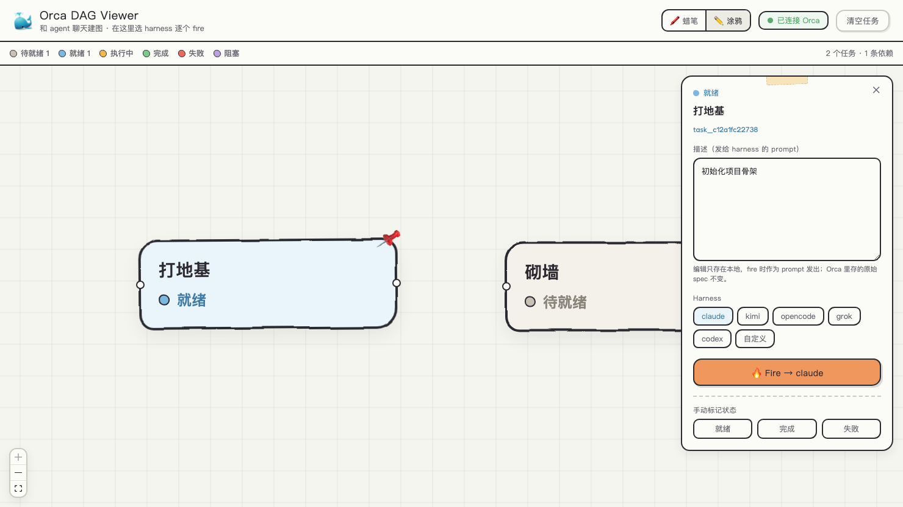

# Orca DAG — skill + viewer

把「和 agent 聊天规划」与「可视化 + 派发」拆成两个独立模块：

1. **skill**（`skill/SKILL.md`）：教**你自己的 agent**（Claude Code / kimi / …）如何把一个需求拆成 **Orca orchestration 的任务 DAG**，以及建图规范。规划的"大脑"在你的 agent 里，**不再内嵌 Claude Agent SDK**。
2. **viewer**（`server/` + `web/`，编译成全局二进制 `orca-dag`）：连到 Orca 的编排状态，**实时可视化**这张 DAG，并支持**逐节点选 harness（kimi / claude / opencode / grok …）并 fire**、**fire 前微调发给 harness 的描述**、处理**审批门**。

> 这是 MVP（内嵌 SDK 的聊天版）之后的重构分支：聊天入口移出应用、交给用户已有的 agent；本仓库只保留「建图规范（skill）」和「可视化 + 派发（viewer）」。




## 它是怎么工作的

```
   你的 agent（加载 orca-dag skill）              orca-dag viewer（全局二进制）
 ┌───────────────────────────────┐            ┌──────────────────────────────┐
 │  和你聊需求 → 拆解 → 建图        │            │  轮询 task-list → 画 DAG        │
 │  Bash: orca orchestration      │            │  选 harness + Fire 某节点       │
 │        task-create / gate-*    │            │  fire 前微调描述（本地 overlay）  │
 └───────────────┬───────────────┘            └───────────────┬──────────────┘
                 │  写编排状态                                    │  读/派发
                 ▼                                              ▼
            ┌──────────────────────  Orca 编排状态  ──────────────────────┐
            │  tasks / deps / gates   ·   terminals（各 harness 会话）      │
            └──────────────────────────────────────────────────────────┘
```

1. 你在**自己的 agent** 里聊需求。agent 加载 `orca-dag` skill，按规范用 `orca orchestration task-create --deps …` 把任务与依赖建进 Orca。
2. DAG 有了雏形，agent 让你打开 viewer（`orca-dag`）。viewer 每 2 秒轮询 `orca orchestration task-list --json`，用 **dagre** 布局、**React Flow** 渲染，状态实时变色。
3. 你在 viewer 里点某个 `ready` 节点 → 选 harness → **Fire**。viewer 会 `orca terminal create --command "<harness>"` 起一个会话，把（可能微调过的）描述 `terminal send` 进去，并把任务标为 `dispatched`。
4. 你可以继续在 agent 对话里增删任务、改依赖、加审批门，viewer 实时反映。

## 前置条件

- **Orca 运行中**：`orca status --json` 的 `result.runtime.state` 应为 `"ready"`；否则先 `orca open`。
- **一个能跑 skill 的 agent**（建图侧）：Claude Code、或任何能读 `SKILL.md` 并执行 Bash 的 agent。
- **viewer 侧只依赖 `orca` CLI** —— 不需要 `claude`、不需要 `ANTHROPIC_API_KEY`（大脑在你的 agent 里）。
- **Bun**（可选，仅打二进制时需要）。**Node.js ≥ 20**（跑 dev / `npm start` 时需要）。

## 模块 1 · 安装 skill

把 `skill/` 作为一个 skill 让 agent 能加载（例如软链到 Claude Code 的 skills 目录）：

```bash
ln -s "$PWD/skill" ~/.claude/skills/orca-dag      # 或直接拷贝
```

然后在 agent 里聊你的需求，它会按 `SKILL.md` 的规范把 DAG 建进 Orca，并在建好后提示你运行 `orca-dag` 打开 viewer。

## 模块 2 · 运行 viewer

开发（前端 5173 + 后端 8787，vite 代理 /api）：

```bash
npm install
npm run dev
# 打开 http://localhost:5173
```

打成全局二进制（推荐，可在任意项目目录直接调用）：

```bash
npm run build:binary                 # 产出 dist/orca-dag（约 60 MB，前端已内嵌）
cp dist/orca-dag /usr/local/bin/     # 装到 PATH

cd ~/any/project
orca-dag                             # 起在 http://localhost:8787，自动开浏览器；用当前目录当工作区
```

交叉编译（目标机自带 `orca` 即可）：`TARGET=bun-linux-x64 npm run build:binary`。
开关：`PORT`（默认 8787）、`NO_OPEN=1`（不自动开浏览器）、`WORKSPACE_DIR`（覆盖 `active` worktree 的工作区）。

## viewer 能做什么

- **实时可视化** DAG，节点状态 `pending / ready / dispatched / completed / failed / blocked` 映射颜色。
- **选 harness 并 Fire**：点节点 → 选 `claude / kimi / opencode / grok / codex` 或自定义命令 → 🔥 Fire。
- **fire 前微调描述**：编辑只存在浏览器本地（overlay），fire 时作为 prompt 发给 harness；节点上标 `✎ 已编辑`。
- **手动标记状态**：就绪 / 完成 / 失败 —— 手动驱动流程时用来推进 DAG（把上游标完成，下游会转 `ready`）。
- **审批门**：agent `gate-create` 后，DAG 上浮出「批准 / 驳回」。
- **两套手绘主题**：🖍️ 蜡笔 / ✏️ 涂鸦，顶栏切换，记忆到 localStorage。

## HTTP 接口

| 方法 | 路径 | 作用 |
| --- | --- | --- |
| `GET` | `/api/dag` | 当前 DAG：`{ nodes, edges, gates, generatedAt }` |
| `GET` | `/api/terminals` | 活动终端（可派发目标）列表 |
| `POST` | `/api/fire` | `{ taskId, harness, prompt }`：起 harness 会话、发送 prompt、标 dispatched |
| `POST` | `/api/dispatch` | `{ taskId, handle }`：派发到已有终端（coordinator 协议） |
| `POST` | `/api/tasks/:id/status` | `{ status }`：直接改任务状态 |
| `POST` | `/api/gates/:id/resolve` | `{ resolution }`：解决审批门 |
| `POST` | `/api/reset` | `orca orchestration reset --tasks` 清空任务 |
| `GET` | `/api/health` | 健康检查 |

## 代码结构

```
skill/SKILL.md            建图规范 + spec 写作约定 + 如何开 viewer + 边界
server/src/
  index.ts                Express 服务：DAG / terminals / fire / dispatch / status / gates / reset；托管 SPA
  orca.ts                 orca CLI 封装：task-list→DAG、terminals、fire（terminal create + send）、状态更新
  webAssets.ts            编译期内嵌前端资源的加载器（生产二进制用）
web/src/
  App.tsx                 全宽 DAG 主壳、每 2s 轮询、主题切换
  components/DagView.tsx   React Flow 图 + 自定义状态节点（含"已编辑"标）
  components/NodePanel.tsx 节点操作面板：编辑描述 / 选 harness / Fire / 标状态
  components/GatePanel.tsx 审批门浮层
  overlay.ts              每任务本地状态（编辑后的描述 / 选定 harness），localStorage
  layout.ts / types.ts / api.ts
scripts/build-binary.mjs  vite build → 内嵌资源 → bun --compile → dist/orca-dag
```

## 设计说明与边界

- **大脑外移**：规划由你已有的 agent 承担（skill 提供规范），viewer 不再内嵌 Claude Agent SDK，也不再需要机器上装 `claude`。解耦更彻底：agent 只管写编排状态，viewer 只管读 + 派发。
- **harness = 终端里的命令**：Orca 没有固定的 harness 枚举，"选 harness" 就是选 `orca terminal create --command "<cmd>"` 里那个命令。所以 viewer 的 harness 列表是纯前端配置，可随意增删、支持自定义。
- **描述改不了（已知约束）**：`orca orchestration task-update` 只能改 `--status` / `--result`，**没有改 spec 的接口**，也没有删除单个任务的命令（只有 `reset` 整体清空）。因此"微调描述"走**本地 overlay**：编辑存在浏览器里，fire 时作为 prompt 发给 harness，Orca 里存的原始 spec 不变（节点标 `✎ 已编辑`）。要真正重写某节点，只能 `reset` 后重建。
- **fire 语义（v1）**：`terminal create --command harness` → `terminal send` 发送（微调后的）描述 → `task-update --status dispatched`。这条路径尊重本地 overlay（发出去的就是你编辑后的文本），且对任意 harness 命令通用。若想要 coordinator 协议接管（worker 自动回报完成），可改用 `/api/dispatch`（`orca orchestration dispatch --inject`，但它的 preamble 取自不可编辑的原始 spec）。
